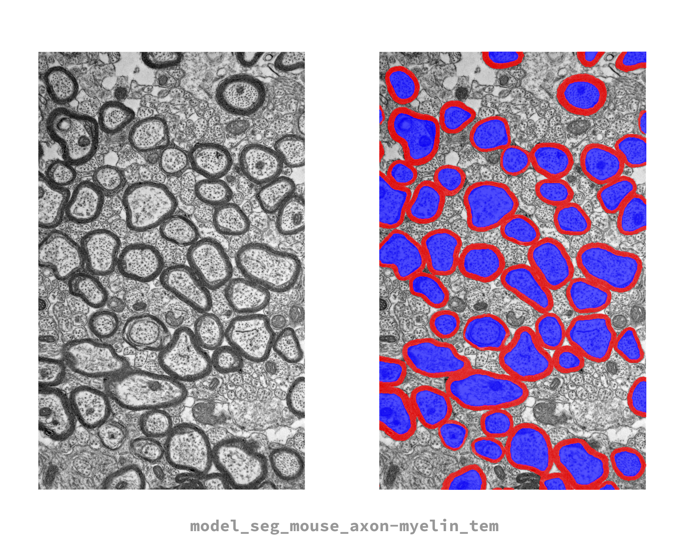

# model_seg_mouse_axon-myelin_tem
---
## Model overview


AxonDeepSeg default TEM model and testing image. This model is suited for a resolution of 0.01 micrometer per pixel and was trained on mouse brain data collected via a Transmission Electron Microscope (TEM).

## Segment (ADS)
To segment an image using this model, use the following command in an `axondeepseg` virtual environment:
```
axondeepseg -t TEM -i <IMG_PATH> -s <PIXEL_SIZE>
```
The `-m` option can be omitted in this case because this is a default built-in model.


## Train and test (ivadomed)
This model was trained and tested with [ivadomed](https://ivadomed.org). We recommend you install ivadomed in a virtual environment to reproduce the original training steps. The specific revision hash of the version used for training is documented in the *version_info.log* file.

### Clone this repository
You will need the *model_seg_mouse_axon-myelin_tem.json* configuration file located in this repo.
```
git clone https://github.com/axondeepseg/default-TEM-model
```

### Get the data
The TEM dataset used to train this model is hosted on git-annex at `data.neuro.polymtl.ca:datasets/data_axondeepseg_tem`. The specific dataset revision hash used for training is documented in the *version_info.log* file.

### Train this model
To train the model, please first update the following fields in the aforementioned JSON configuration file:
- `gpu_ids`: specific to your hardware
- `path_output`: where the model will be saved
- `loader_parameters:path_data`: path to training data
- `loader_parameters:bids_config`: path to the custom bids config located in `ivadomed/config/config_bids.json`
- `split_dataset:fname_split`: path to the split_dataset.joblib file

Then, you can train the model with
```
ivadomed --train -c path/to/model_seg_mouse_axon-myelin_tem.json
```
The trained model file will be saved under the `path_output` directory. For more information about training models in `ivadomed`, please refer to the following [tutorial](https://ivadomed.org/tutorials/two_class_microscopy_seg_2d_unet.html).

### Evaluate this model
To test the performance of this model, use
```
ivadomed --test -c path/to/model_seg_mouse_axon-myelin_tem.json
```
The evaluation results will be saved in `"path_output"/results_eval/evaluation_3Dmetrics.csv`
